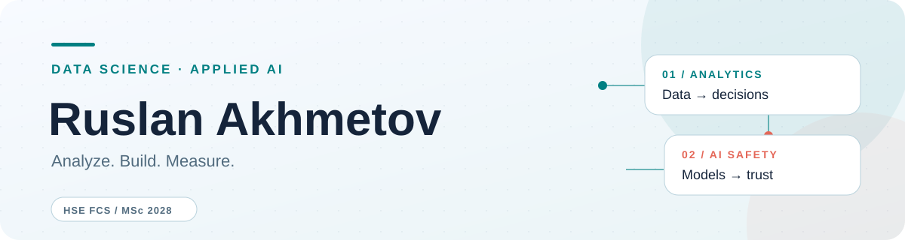

  <picture>
    <source media="(prefers-color-scheme: dark)" srcset="assets/profile-banner-dark.svg">
    
  </picture>

<h1 align="center">Привет, я Руслан 👋</h1>

  <strong>Data Scientist · Applied AI · Product thinking</strong> 
  Исследую данные, строю ML-решения и ищу, как сделать AI полезным в реальном продукте.

  
  
  
  

---

## Чем я занимаюсь

Я учусь в магистратуре ФКН НИУ ВШЭ и развиваюсь в Data Science и LLM-инжиниринге. В работе мне интересна вся цепочка: **понять задачу → изучить данные → построить решение → измерить его пользу**. Работал над голосовым AI-помощником в МегаТехе и умным поиском для бизнеса в Альфа-Банке.

## Публичные проекты

### 01 · Продуктовая аналитика

[**MA-Big-Data-Analytics →**](https://github.com/9ecolla/MA-Big-Data-Analytics)

Учебные проекты магистратуры. Первый проект — анализ розничных транзакций: очистка данных, сегментация покупателей, выручка заказов и проверка временной метрики.

### 02 · Безопасность генеративного AI

[**img-censorship-module →**](https://github.com/9ecolla/img-censorship-module)

MVP модуля модерации для генерации и редактирования изображений. Объединяет текстовые и визуальные сигналы и возвращает объяснимое решение: `allow`, `review` или `block`.

## С чем работаю

- **Данные и ML:** Python, SQL, Pandas, NumPy, scikit-learn, CatBoost, PyTorch.
- **LLM-приложения:** RAG, LangChain, LangGraph, Hugging Face, OpenAI API.
- **Инструменты:** Jupyter, Git, Docker, Matplotlib, Seaborn.

## На связи

[Kaggle](https://www.kaggle.com/ecolla999) · [Telegram @ecolla9](https://t.me/ecolla9) · [LinkedIn](https://www.linkedin.com/in/ruslan-akhmetov-b8a069391/) · [Резюме PDF](assets/Ruslan_Akhmetov_CV_2026.pdf)
