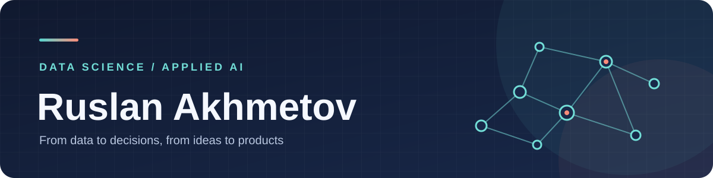

  

<h1 align="center">Привет, я Руслан Ахметов 👋</h1>

  <strong>Data Scientist · Applied AI · LLM-системы</strong> 
  Студент магистратуры ФКН НИУ ВШЭ. Превращаю данные и AI-идеи в работающие продуктовые решения.

## Обо мне

Мне интересен путь от постановки задачи и анализа данных до модели, оценки качества и внедрения в продукт. Работал над голосовым AI-помощником в МегаТехе и над умным поиском для бизнеса в Альфа-Банке. Сейчас развиваюсь в области LLM, RAG и прикладного машинного обучения.

> Люблю задачи на стыке **данных, продукта и инженерии**: когда важны и качество модели, и польза для человека.

## Избранные проекты

| Проект | О чём работа |
| --- | --- |
| [Анализ транзакций и решение продуктовой задачи](https://github.com/9ecolla/MA-Big-Data-Analytics/tree/main/Программирование%20на%20Python/Решение%20продуктовой%20задачи) | Очистка розничных данных, анализ покупателей и заказов, проверка временной метрики |
| [Демо RAG-пайплайна](https://github.com/9ecolla/Data-Science-/blob/main/FCS/rag_demo_dnd_colab.ipynb) | Извлечение текста из PDF, эмбеддинги, поиск через FAISS и генерация ответа с контекстом |
| [Оценка стоимости автомобиля](https://github.com/9ecolla/Data-Science-/blob/main/Python/Ed_task_ML_%20linear_regression%20.ipynb) | Учебная задача машинного обучения: подготовка данных и регрессионная модель |

Больше учебных работ — в [репозитории магистратуры](https://github.com/9ecolla/MA-Big-Data-Analytics) и [архиве проектов по Data Science](https://github.com/9ecolla/Data-Science-).

## Инструменты

| Направление | Использую |
| --- | --- |
| Анализ данных и ML | Python, SQL, Pandas, NumPy, scikit-learn, CatBoost, PyTorch |
| LLM и AI-приложения | RAG, LangChain, LangGraph, Hugging Face, OpenAI API |
| Визуализация и работа | Matplotlib, Seaborn, Jupyter, Git, Docker |

## Мои контакты

  
  
  
  

  <a href="https://www.kaggle.com/ecolla999">Kaggle</a> ·
  <a href="https://t.me/ecolla9">Telegram</a> ·
  <a href="https://www.linkedin.com/in/ruslan-akhmetov-b8a069391/">LinkedIn</a> ·
  <a href="assets/Ruslan_Akhmetov_CV_2026.pdf">Резюме (PDF)</a>

